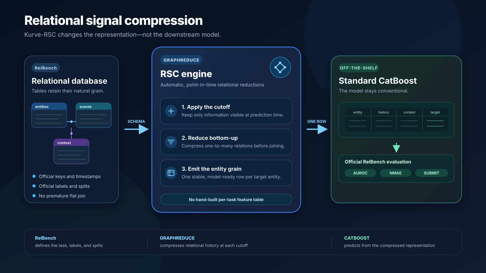

# Kurve-RSC Benchmark

Kurve-RSC benchmarks **relational signal compression (RSC)**: it compresses a
multi-table database into one point-in-time row per prediction entity and
feeds that representation to standard, off-the-shelf CatBoost. The approach
does not depend on a custom predictor or a hand-engineered feature table for
each task. Its contribution is the relational representation produced before
CatBoost sees the data.

“Standard CatBoost” is more precise here than “vanilla CatBoost.” Kurve-RSC
uses the unmodified CatBoost library, but ordinary hyperparameters may be
selected on validation data and training may continue incrementally across
cutoff frames. The model is conventional; the relational signal compression
is the part being evaluated.

The harness currently covers all 12 binary-classification and all 9 regression
tasks in the seven original RelBench databases.



The relational computation is powered by
[GraphReduce](https://github.com/wesmadrigal/graphreduce), a general-purpose
system for expressing tables as graph nodes, relationships as edges, and
leakage-safe reductions as executable feature pipelines. This repository is
the benchmark integration around GraphReduce: it owns the RelBench schema
adapters, cutoff scheduling, model fitting, evaluation, reporting, and
leaderboard prediction files.

```text
RelBench relational database
            |
            v
 GraphReduce relational signal compression
 - schema graph: tables, keys, edges, time
 - leakage-safe filtering at each cutoff
 - automatic bottom-up reductions in DuckDB
            |
            v
 one model-ready row per prediction entity
            |
            v
 standard CatBoost (default)
            |
            v
 RelBench metrics and submission CSVs
```

## How it works

Each task follows the same high-level lifecycle:

1. The adapter loads the official RelBench database and task tables. RelBench
   remains the source of entity keys, timestamps, labels, temporal splits, and
   evaluation metrics.
2. Relational tables become GraphReduce `DuckdbNode` objects. The adapter
   declares schema rather than predictive feature formulas: primary keys, date
   keys, stable prefixes, eligible columns, and the edges that connect each
   relation to the prediction entity.
3. For every configured training, validation, or test timestamp, GraphReduce
   filters the graph to information visible at that cutoff. Task adapters
   account for the boundary convention of each dataset so future rows and the
   label horizon cannot leak into features.
4. GraphReduce traverses the graph bottom-up. One-to-many child relations are
   reduced before they are joined, producing cardinality-safe aggregates at
   the parent grain instead of a duplicated, fan-out-heavy flat join.
5. The resulting entity frame is joined to the matching RelBench task table.
   Multi-cutoff training frames spill to Parquet so the complete feature set
   does not have to remain in memory.
6. The resulting table goes into the standard CatBoost classifier or regressor
   without a custom model layer. CatBoost is fitted incrementally across
   training frames by default; joint fitting and an optional TabPFN comparison
   are also supported. Final metrics use the official RelBench evaluator.
7. In submission mode, predictions are joined back to the untouched official
   test keys and written as `<dataset>__<task>.csv`. The run fails if a new
   prediction table does not cover the exact test key set.

GraphReduce performs the relational signal compression, not label construction
or benchmark scoring. That separation is important: RelBench defines the
prediction problem, GraphReduce builds the point-in-time representation, and
an off-the-shelf estimator maps that representation to the target.

### Relational signal compression, not custom feature engineering

Kurve-RSC does not maintain a manually curated predictive feature table for
each task. It maps the database schema into GraphReduce and uses
`auto_features=True` on DuckDB. GraphReduce then applies reusable,
schema-aware operations based on column type, relationship cardinality, time
window, and reduction grain. Depending on the relation, those operations come
from combinations of these GraphReduce feature families:

- `base`: schema-aware counts, distinct counts, numeric rollups, categorical
  summaries, recency, and volume
- `semantic`: reusable annotations evaluated before reduction
- `conditional`: windowed counts and shares for meaningful conditions
- `temporal`: numeric summaries over multiple lookback windows
- `sequence`: cadence, concentration, and burstiness
- `episode`: row counts versus distinct real-world records
- `context`: comparisons within a defensible peer group

This is automated relational compression, not a collection of bespoke feature
formulas tuned to individual targets. The Trial adapter is fully schema-driven:
it derives every node, column, timestamp, and edge from RelBench metadata and
uses the same feature-selection and modeling policy for all three Trial tasks.
To keep cyclic schemas bounded, it constructs a deterministic spanning tree
rooted at the task's official entity table and applies a uniform one-hop
GraphReduce feature depth.

GraphReduce `1.10.2` is installed from
[PyPI](https://pypi.org/project/graphreduce/). A neighboring GraphReduce source
checkout is not required.

## Repository layout

```text
kurve_rsc/       RelBench adapters, graph builders, feature/model utilities
scripts/         single-task and task-family entry points
configs/         family defaults and task runtime settings
tests/           reproducibility, cutoff, feature, and submission checks
results/         generated logs, reports, frame artifacts, and predictions
```

The scripts in `kurve_rsc/` originated from working GraphReduce RelBench
examples and are maintained here as benchmark adapters. GraphReduce remains
the reusable relational engine; benchmark policy stays in this repository.

## Installation

Python 3.12 is recommended. The project supports Python 3.10 through 3.12.

```bash
python3.12 -m venv .venv
source .venv/bin/activate
python -m pip install --upgrade pip
python -m pip install -e .
```

The benchmark pins `graphreduce==1.10.2` and `relbench==2.1.1` so runs use the
same relational and dataset APIs as the reproduced results.

## Running the benchmark

Run one task by script name, with or without the `.py` suffix:

```bash
python scripts/run_task.py relbench_event_user_ignore.py
```

Run a complete task family:

```bash
python scripts/run_all.py --task-type classification
python scripts/run_all.py --task-type regression
python scripts/run_all.py --task-type v1
```

`v1` runs all 21 supported tasks. Use `--stream-output` for full live task
output or `--stop-on-error` to stop a family run after its first failure.

Reports, task logs, and machine-readable summaries are written below
`results/`. During multi-cutoff construction, feature frames are materialized
as Parquet files and released after training when the task permits it.

### Feature-family modes

The default preserves every task's current configured feature-family policy.
For a base-family-only comparison, pass `--baseline` to a family run:

```bash
python scripts/run_all.py --task-type classification --baseline
```

The same option is accepted by the single-task launcher and by every task
script directly:

```bash
python scripts/run_task.py relbench_event_user_ignore.py --baseline
python kurve_rsc/relbench_event_user_ignore.py --baseline
```

Baseline mode is a final top-level override: every graph node uses exactly the
`base` family, including nodes that normally enable semantic, conditional,
temporal, sequence, episode, or context families. Omitting the option retains
the existing behavior. Reports record whether baseline mode was enabled.

### Training cutoffs and concurrency

Every feature frame is tied to a task timestamp. The default is each task's
configured historical schedule; large tasks may use a reproducible bounded
schedule to control runtime. To run only the latest official training period:

```bash
python scripts/run_task.py relbench_event_user_ignore.py \
  --single-train-period
```

That cutoff is computed as `dataset.val_timestamp - task.timedelta`, so the
task's label horizon determines the date. Omitting the flag retains the normal
task schedule.

Feature-frame construction is sequential by default. Bound concurrency on a
large machine with:

```bash
python scripts/run_all.py \
  --task relbench_avito_user_clicks.py \
  --training-frame-workers 50
```

Use `--training-frame-workers all` to request one worker per training frame.
Each worker receives its own DuckDB cursor, and source tables are materialized
where necessary to avoid temporary-table collisions.

The three `rel-stack` tasks use 15 reproducibly selected training cutoffs
instead of all 46; the most recent training cutoff is always retained.
Validation and test schedules are not sampled. Long-running Stack tasks emit
`feature_frame_progress` lines as cutoff frames finish.

### Model backends

CatBoost is the default. It continues training across cutoff frames to keep
peak memory bounded. To materialize the selected frames and fit candidate
configurations jointly with validation-based early stopping, use:

```bash
python scripts/run_task.py relbench_event_user_ignore.py \
  --train-all-at-once
```

Joint fitting can use substantially more memory. Pass
`--no-train-all-at-once` or omit the flag for incremental training.

Use TabPFN instead of CatBoost with:

```bash
python scripts/run_task.py relbench_event_user_ignore.py --tabpfn
```

The runner selects `TabPFNClassifier` or `TabPFNRegressor` from the task type.
`--single-train-period` is recommended for large TabPFN runs because TabPFN
combines the selected frames into one in-memory matrix. First use may download
a checkpoint and require accepting the model license; see the
[official TabPFN documentation](https://github.com/PriorLabs/TabPFN#basic-usage).

`rel-event/user-ignore` applies the same stability principle to computation:
it captures the first training cutoff's GraphReduce operation plan, replays it
for later cutoffs, and fits only on feature columns present in every training,
validation, and test frame.

## Metrics

Classification uses AUROC on the official RelBench split. Regression reports
NMAE:

```text
NMAE = MAE / standard deviation of the training targets
```

The denominator is computed from training targets only. Validation and test
targets never contribute to it.

## Leaderboard submissions

Generate a complete official-format prediction family with
`--submission-dir`:

```bash
python scripts/run_all.py \
  --task-type classification \
  --submission-dir results/submissions/kurve-rsc-classification
```

Use `--task-type regression` and a separate directory for the regression
leaderboard. Submission mode requires the complete family and therefore cannot
be combined with `--task` or `--match`. Normal benchmark runs do not write
prediction tables.

Add `metadata.yaml` at the root of the submission directory:

```yaml
name: Kurve-RSC
type: fine-tuned
email: maintainer@example.com
url: https://github.com/kurveai/kurve-rsc-benchmark
note: Kurve relational signal compression with GraphReduce
```

The benchmark environment remains on the legacy RelBench API. Validate from a
separate environment containing the newer `relbench.leaderboard` module; do
not upgrade the benchmark environment in place.

```bash
SUB_DIR="$PWD/results/submissions/kurve-rsc-classification"
python -m relbench.leaderboard "$SUB_DIR"
```

Create a clean ZIP containing only the 12 classification CSVs and the root
metadata file. Python's standard library works on headless remote machines:

```bash
ZIP_PATH="$PWD/kurve-rsc-classification.zip"
(
  cd "$SUB_DIR" || exit 1
  python -m zipfile -c "$ZIP_PATH" metadata.yaml *.csv
)
python -m zipfile -l "$ZIP_PATH"
```

Submit from that machine with:

```bash
curl --fail-with-body \
  -F "file=@${ZIP_PATH}" \
  https://stanford-star-relbench-validator.hf.space/submit
```

A successful upload returns `pending_review` and a review URL. See the
[official RelBench submission documentation](https://github.com/stanford-star/relbench/blob/relbench-hf/README.md#submitting-to-the-leaderboard)
for the current server-side format and review process.

## Scope

This harness deliberately targets the RelBench v1 entity tasks from Amazon,
Avito, Event, F1, H&M, Stack, and Trial. Recommendation tasks and RelBench v2
tasks are outside the current benchmark until compatible adapters are added.
