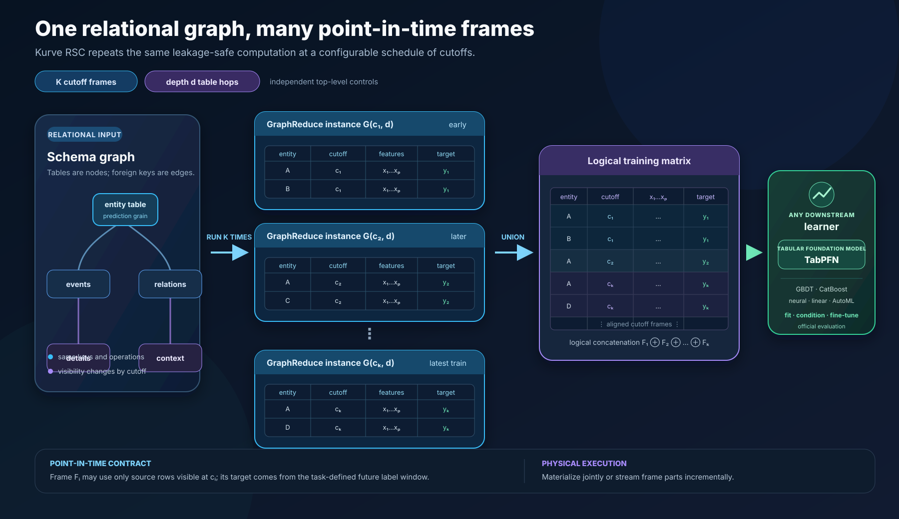
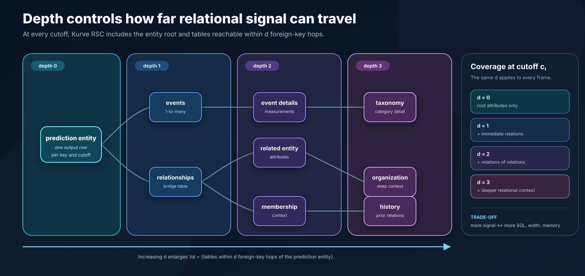

\newpage

# Abstract

Kurve RSC is a framework for **relational signal compression**: the conversion
of a time-varying, multi-table database into leakage-safe, model-ready rows at
a chosen prediction grain. Rather than flattening the database once, Kurve RSC
instantiates a relational compute graph repeatedly at a configurable sequence
of cutoffs. Every instantiation emits one dataframe containing the entities,
features, cutoff, and task label for that point in time. The cutoff-specific
frames form one logical training matrix that can fit, condition, or fine-tune
any compatible downstream learner. This includes conventional gradient-boosted
trees and neural models as well as tabular foundation models such as TabPFN.

Two independent top-level controls define the scale of the representation.
The **frame count** $K$ determines how many historical cutoff views are
generated. The **relational depth** $d$ determines how many foreign-key hops
can contribute signal to each view. Feature-family selection then determines
what information survives each many-to-one reduction. These controls expose a
clear trade-off between relational coverage, temporal coverage, feature width,
row count, and computation.

Kurve RSC uses the open-source
[GraphReduce project](https://github.com/wesmadrigal/graphreduce) as its
relational execution engine. GraphReduce represents tables as nodes, keys as
edges, and filtering, annotation, aggregation, and joining as an executable
compute graph. Kurve RSC supplies the benchmark-facing orchestration around
that engine: schema adaptation, cutoff scheduling, repeated frame generation,
feature alignment, disk-backed frame storage, downstream learner adaptation,
official evaluation, and prediction-file validation.

# Executive summary

The central idea is easier to understand as a loop than as one large join:

```text
for cutoff c in selected_cutoffs:                 # K is configurable
    graph = instantiate(database, root, depth=d)  # d is configurable
    graph.filter_to_information_visible_at(c)
    graph.reduce_relations_to_the_root_grain()
    frame[c] = graph.entity_dataframe() + task_labels[c]

training_matrix = align_and_union(frame[c] for c in selected_cutoffs)
learner = fit_condition_or_finetune(training_matrix, validation_frame)
```

Each frame answers a precise historical question: *what could the system have
known about this entity at this cutoff?* Repeating that question at several
cutoffs turns a relational database into a longitudinal tabular training set.
The resulting matrix contains repeated entity keys when the same entity is
eligible at more than one cutoff; those rows are distinct observations because
their visible histories and future label windows differ.

Kurve RSC separates four responsibilities:

| Layer | Responsibility |
|---|---|
| Task specification | Official entity keys, timestamps, labels, temporal splits, and metrics |
| Kurve RSC | Cutoff schedule, depth, feature policy, frame lifecycle, training, and validation |
| GraphReduce | Point-in-time graph execution, bottom-up reduction, and feature propagation |
| Downstream learner | Mapping the unified entity representation to a prediction |

This separation is deliberate. RelBench defines the prediction problem;
GraphReduce executes relational algebra; Kurve RSC defines the repeated
representation-learning workflow; and the emitted dataframe is a
learner-agnostic interface. CatBoost is the default conventional learner, but
the same frame contract supports linear models, neural tabular models, AutoML
systems, and---most interestingly---pretrained tabular foundation models such
as TabPFN. Kurve RSC's main contribution is the relational and temporal
representation presented to whichever learner follows it.

The rest of this report proceeds from the system-level view to the detailed
feature program. The first sections explain multi-cutoff frame generation,
graph depth, point-in-time correctness, and downstream learning; the **Kurve
RSC Feature Families** and their interactions follow. Later sections discuss
cost, prior work, reproducibility, limitations, and GraphReduce's role.

# Kurve RSC at a glance

## Inputs and output

Kurve RSC begins with:

- a relational database $\mathcal{D}$ whose tables expose primary and foreign
  keys;
- a prediction task $\mathcal{T}$ with an entity table, entity key, timestamp,
  target, split schedule, and evaluator;
- a cutoff sequence $C = (c_1, c_2, \ldots, c_K)$;
- a graph-depth budget $d$;
- a feature-family policy $\mathcal{A}$; and
- a finite estimator configuration set $\mathcal{H}$.

For every cutoff $c_i$, the framework emits an entity-grain frame

$$
F_i = \left[ e,\; c_i,\; \phi_1(e,c_i),\ldots,\phi_p(e,c_i),\; y(e,c_i) \right],
$$

where $e$ is an official task entity, each $\phi_j$ is computed only from
information visible at $c_i$, and $y(e,c_i)$ is supplied by the task's future
label window. The logical training relation is the row union

$$
F_{\text{train}} = F_1 \oplus F_2 \oplus \cdots \oplus F_K.
$$

The symbol $\oplus$ means schema-aligned row concatenation. It does not mean
that every frame must be held in memory simultaneously; Kurve RSC can persist
the parts and stream them during training.

## The complete lifecycle

{width=100%}

The lifecycle has seven stages:

1. **Read the task contract.** Load the official entity keys, timestamps,
   labels, train/validation/test partitions, and evaluator.
2. **Construct the relational graph.** Represent source tables as graph nodes
   and primary--foreign key relations as edges. Select the root entity and the
   depth budget.
3. **Instantiate at a cutoff.** Bind a fresh graph execution to $c_i$, the
   historical compute horizon, and the task entities eligible at that cutoff.
4. **Compress relational history.** Filter future information, compute node
   features, reduce one-to-many relations, and propagate the summaries toward
   the root.
5. **Emit one entity frame.** Join the root representation to the matching
   task rows and persist the result as $F_i$.
6. **Align the frames.** Freeze a compatible feature order and create the
   logical row union across selected training cutoffs.
7. **Adapt and evaluate a downstream learner.** Fit a conventional estimator,
   condition a pretrained learner in context, or fine-tune a compatible model;
   then score with the official evaluator. Test labels do not participate in
   selection.

## Two independent scale controls

The most important architectural distinction is between **how often** the
graph is evaluated and **how far** signal travels inside each evaluation.

| Control | Symbol | Changes | Primarily grows |
|---|---:|---|---|
| Cutoff-frame count | $K$ | Number of historical graph instantiations | Training rows and graph executions |
| Relational depth | $d$ | Foreign-key distance from the prediction root | Included tables, feature width, and reduction work |

Increasing $K$ does not include a deeper table. Increasing $d$ does not create
another historical observation. A run can therefore be temporally broad but
relationally shallow, relationally broad but temporally sparse, broad on both
axes, or deliberately small on both.

At the architecture level, $K$ is any positive integer supported by the task's
valid timestamp schedule. In the benchmark harness the selected cutoff list is
the top-level realization of $K$: a task may use the complete official
schedule, one canonical cutoff, or a reproducibly selected bounded subset.
Likewise, $d$ is a nonnegative graph parameter, realized by GraphReduce's
directional auto-feature hop settings. Both should be reported with results.

# Multi-cutoff frame generation

## Why instantiate the graph more than once?

A single snapshot teaches the estimator about one historical state. A cutoff
sequence teaches it how similar entities look at several stages of their
history. For a user task, the same user may have little activity at $c_1$, a
bursty recent history at $c_2$, and a mature history at $c_K$. For a clinical
study, each cutoff may expose a different set of reported events, facilities,
or outcomes. The entity key can repeat, but the row represents a new
point-in-time prediction opportunity.

The graph topology and feature policy ordinarily remain fixed across the loop.
What changes is the cutoff-dependent visibility of source rows, the eligible
task entities, and the associated future label window. This repeated
instantiation is what turns relational feature synthesis into a training-set
generator rather than a one-time reporting query.

## One frame per cutoff

Suppose two entities are eligible at three cutoffs. Kurve RSC builds the frames
independently:

**Frame $F_1$ at cutoff $c_1$**

| entity | cutoff | lifetime events | 30-day events | amount sum | target |
|---|---|---:|---:|---:|---:|
| A | $c_1$ | 3 | 2 | 45 | 0 |
| B | $c_1$ | 1 | 1 | 12 | 1 |

**Frame $F_2$ at cutoff $c_2$**

| entity | cutoff | lifetime events | 30-day events | amount sum | target |
|---|---|---:|---:|---:|---:|
| A | $c_2$ | 8 | 4 | 131 | 1 |
| C | $c_2$ | 2 | 2 | 28 | 0 |

**Frame $F_K$ at the latest selected training cutoff**

| entity | cutoff | lifetime events | 30-day events | amount sum | target |
|---|---|---:|---:|---:|---:|
| A | $c_K$ | 14 | 3 | 247 | 0 |
| D | $c_K$ | 5 | 5 | 91 | 1 |

After schema alignment, the logical training matrix is:

| entity | cutoff | lifetime events | 30-day events | amount sum | target |
|---|---|---:|---:|---:|---:|
| A | $c_1$ | 3 | 2 | 45 | 0 |
| B | $c_1$ | 1 | 1 | 12 | 1 |
| A | $c_2$ | 8 | 4 | 131 | 1 |
| C | $c_2$ | 2 | 2 | 28 | 0 |
| A | $c_K$ | 14 | 3 | 247 | 0 |
| D | $c_K$ | 5 | 5 | 91 | 1 |

This is a row union, not a key-based merge between cutoffs. Joining $F_1$ to
$F_2$ horizontally would put features from different prediction times on the
same row and would destroy the intended training semantics.

## The cutoff schedule is a top-level parameter

Let $C_{\mathrm{valid}}$ be the task's valid training schedule. Kurve RSC
selects an ordered subset $C \subseteq C_{\mathrm{valid}}$ and sets
$K=|C|$. Useful policies include:

- **latest only:** $K=1$, useful for fast diagnostics or memory-constrained
  experiments;
- **full schedule:** every valid official training cutoff;
- **bounded schedule:** a deterministic subset, normally retaining the latest
  cutoff and spreading the remainder over history; and
- **domain schedule:** cutoffs chosen at meaningful task intervals, provided
  every selected point obeys the official task contract.

Frame count and construction concurrency are separate. `K=50` means fifty
historical frames. `training_frame_workers=15` means at most fifteen frames are
built concurrently; it does not reduce $K$ to fifteen.

## Independent frames enable parallel construction

Once the database sources are registered, $F_i$ depends on $c_i$ but not on
the output of $F_{i-1}$. The computation is therefore embarrassingly parallel
at the frame level. Kurve RSC can give each worker its own DuckDB cursor and
yield completed frames in deterministic schedule order.

Parallelism changes wall-clock time and peak resource usage, not feature
semantics. A reproducible run records both $K$ and worker count because two
runs may use identical training rows while having very different execution
profiles.

## Logical union, physical streaming

The notation $F_{\text{train}}=\oplus_i F_i$ describes the logical dataset.
Kurve RSC supports two physical interpretations:

| Mode | Physical behavior | Strength | Cost |
|---|---|---|---|
| Joint | Materialize aligned parts into one in-memory matrix before fitting | Conventional global fit and early stopping | Higher peak memory |
| Incremental | Read one persisted frame or batch at a time and continue the same model | Bounded memory | Training order and per-frame iteration allocation matter |

The frame store keeps small runs in memory and spills larger runs to numbered
Parquet parts. This separates representation generation from model memory:
all selected frames can participate even when their combined dataframe does
not fit comfortably in RAM.

# Relational depth and signal coverage

## Database metadata becomes a compute graph

Kurve RSC consumes schema metadata rather than beginning with a pre-flattened
table. For each source relation it needs a stable name, primary key, optional
time key, and eligible columns. Foreign-key declarations connect child rows to
their parent entities. The task's entity table becomes the root grain.

GraphReduce [1] executes this representation as a graph of table nodes and
join edges. Kurve RSC uses bottom-up reduction so a one-to-many child is grouped
to one row per parent key before joining upward. This preserves parent
cardinality and avoids the uncontrolled fan-out of a raw multi-table join.

## Depth is a top-level coverage parameter

Define the included table set at depth $d$ as

$$
V_d = \{v \in V : \operatorname{dist}(v,r) \leq d\},
$$

where $r$ is the prediction entity table and distance is measured along
eligible primary--foreign key edges. The directional GraphReduce hop controls
refine which inward or outward paths can propagate features.

{width=100%}

At each cutoff:

- $d=0$ uses only attributes already present at the prediction entity grain;
- $d=1$ adds immediate events and bridge relations;
- $d=2$ adds relations of those relations, such as referenced entity
  attributes or event details; and
- larger $d$ admits progressively deeper relational context.

The depth is arbitrary in the sense that it is a top-level nonnegative
parameter, not a feature formula tied to a task. Its effective maximum is the
reachable schema diameter and its practical maximum is constrained by compute
budget.

## Signal propagates by reduction

Consider a three-hop path:

```text
prediction entity <- transactions <- line items -> products
       depth 0           depth 1        depth 2       depth 3
```

At depth three, product attributes can be summarized at the line-item grain,
line-item summaries can be reduced to each transaction, and transaction
summaries can be reduced to the prediction entity. Each stage changes the
grain before the next join. The final root row may therefore contain both
direct transaction statistics and summaries derived from deeper product
context.

A feature family is evaluated at a node and reduction hop; it is not one fixed
global column list. The same `temporal` policy can create different columns on
an event table and a transaction table because their schemas, dates, and
reduction keys differ.

## Depth, cycles, and totality

"Use all available relational signal" must always be qualified by the chosen
depth and edge policy. Within the configured subgraph, the intended behavior
is to expose every eligible table and column to generic reduction. A shallower
depth deliberately excludes farther signal.

Real schemas may contain cycles or multiple paths to the same table. Blindly
unrolling every path can repeat a relation indefinitely or multiply equivalent
features. A production graph builder therefore needs a deterministic cycle
policy: for example, a cycle-free traversal, explicit edge orientation, or a
bounded path expansion with stable namespaces. The selected policy must be
reported because "all tables" and "all paths" are not the same claim.

## Coverage and cost

Increasing $d$ can increase:

- the number of scanned tables and edges;
- SQL plan size and intermediate materializations;
- feature width after each reduction;
- categorical expansion and windowed aggregates; and
- peak memory, especially when already-reduced columns are re-aggregated at
  another hop.

The cost can grow faster than linearly when width compounds across hops. Depth
should therefore be treated as an experimental axis and resource budget, not
as an automatic instruction to choose the schema maximum.

# Point-in-time correctness

## The visibility contract

For a prediction cutoff $c_i$, every feature must be computable using only
source information available at or before the task's boundary convention.
The task label belongs to a future window and is joined only after feature
construction. In symbols, a feature row should satisfy

$$
\phi(e,c_i) = f\!\left(\{x : t(x) < c_i\}\right),
$$

or the task's documented inclusive equivalent. A SQL engine's strict versus
inclusive comparison must be reconciled explicitly at the adapter boundary.

## Cutoff, compute horizon, and label horizon

Three time concepts should not be conflated:

| Concept | Purpose |
|---|---|
| Cutoff $c_i$ | Point at which the prediction is made |
| Compute horizon | How far backward source rows may contribute |
| Label horizon | Future interval used by the task to construct $y(e,c_i)$ |

A 365-day feature window cannot recover rows if the compute horizon admits
only 90 days. Conversely, extending the compute horizon must never cross the
cutoff into the label window.

## Time-aware nodes

Every time-varying relation should declare the timestamp used for filtering.
GraphReduce can then apply the cutoff during aggregation and calculate recency,
window counts, and family-specific temporal features relative to the graph's
reference time. Static dimension tables need no date filter but still must be
joined through a valid historical schema relationship.

## Split discipline

Kurve RSC keeps these roles separate:

- training cutoffs generate labeled fitting frames;
- validation cutoffs select model settings and may determine early stopping;
- test rows receive predictions only after the representation and model policy
  are fixed; and
- official task evaluators compute the reported metric.

Target-derived decisions must use training and validation only. The test split
must not select feature families, depth, frame count, category values, model
configuration, clipping rules, or blends.

# From frames to downstream learning

## Learner interoperability

Kurve RSC terminates in an ordinary dataframe contract rather than a
model-specific hidden representation. Once the cutoff frames are aligned, any
learner that accepts tabular rows can sit downstream:

- gradient-boosted trees such as CatBoost, XGBoost, or LightGBM;
- linear, generalized linear, neural-tabular, and AutoML systems;
- in-context or fine-tuned tabular foundation models; and
- task-specific learners that preserve the same split and prediction-key
  contract.

This interoperability is architectural, not a claim that every possible
library already has a bundled adapter. The current benchmark harness provides
CatBoost as its conventional default and TabPFN as its tabular-foundation-model
backend. Additional learners need only consume the frozen feature matrix and
return predictions in official task-row order.

Tabular foundation models are especially interesting here. Kurve RSC can act
as a relational context compiler: it turns a depth-bounded, time-censored
database into the rows and columns on which a pretrained tabular model reasons.
TabPFN can condition on the generated training matrix in context and supports
fine-tuning [6]; newer Prior Labs systems broaden the supported scale and
structured-data settings [7]. The relational representation and downstream
statistical prior remain separable, so either side can improve without
redesigning the other.

## Feature-schema alignment

Different cutoffs can expose different sampled categories or sparse columns.
Before fitting, Kurve RSC selects a stable model-facing schema and order.
Training, validation, and test frames are reindexed to that layout. Missing
numeric values receive a consistent numeric representation; categorical
columns receive a stable missing token and categorical index layout.

Feature alignment protects against two failure modes: allowing a late cutoff
to silently change the model's column meaning, and passing a validation/test
column that never existed during training.

## Training and adaptation protocol

For conventional supervised learners, Kurve RSC can compare a finite set of
ordinary configurations. In the reference CatBoost path, classification
candidates are compared by validation AUROC and regression candidates by
validation error. The selected configuration is then used for validation/test
prediction under the frozen feature policy.

This report uses **fine-tuned** in the benchmark sense: the downstream model's
ordinary hyperparameters are selected on validation data and its parameters
are adapted to the generated relational frames. For a foundation model, the
more precise operation may be in-context conditioning, inference-time
configuration, or gradient-based fine-tuning. Those modes should be named
explicitly rather than collapsed into one ambiguous use of "training."

CatBoost [4] is the default because it handles mixed numerical and categorical
tables while providing a strong conventional tabular baseline. TabPFN [6] is a
first-class alternative because the unified Kurve RSC frame is already the
tabular context it expects. Foundation-model context limits and row/column
budgets may favor a smaller $K$, a smaller $d$, or bounded feature families;
that resource choice does not change the point-in-time frame contract.

## Incremental versus all-at-once fitting

With joint fitting, all selected frame parts are materialized into
$F_{\text{train}}$ and one model fit sees the complete matrix at once. With
incremental fitting, the same logical frames are replayed in cutoff order and
CatBoost continues from the prior model. Iterations are allocated across the
available batches so the total configuration budget remains controlled.

The two modes optimize different operational constraints. Joint fitting is
conceptually simplest and can use global early stopping. Incremental fitting
supports much larger logical training sets with bounded peak memory. The mode
is part of the experimental configuration and should be reported. In-context
foundation models ordinarily consume a jointly materialized context or their
own chunked/context-management mechanism rather than CatBoost's continuation
semantics.

## Evaluation and output integrity

Classification tasks use the official task metric, commonly AUROC. Regression
tasks use the official error metric and Kurve RSC may additionally report
normalized mean absolute error,

$$
\operatorname{NMAE} =
\frac{\operatorname{MAE}(y,\hat{y})}
{\operatorname{std}(y_{\mathrm{train}})}.
$$

The normalization denominator comes from training targets only. Submission
generation joins predictions back to untouched official test keys and checks
exact key coverage before writing a file.

\newpage

# Empirical results

## RelBench v1 entity classification

Kurve RSC was evaluated on all 12 entity-classification tasks in RelBench v1.
The run used CatBoost, multiple official training cutoffs
(`single_train_period=false`), joint all-at-once fitting, and the official
RelBench evaluators. Most runners used the full available training schedule;
the two Stack classification runners used the reproducible 15-frame policy
described in Exhibit A. All 12 tasks completed and produced validated
submission files. The **configured** Kurve RSC column below reports test AUROC
from that August 25, 2026 run. Its validation macro-average was 0.7997 and its
test macro-average was 0.8020.

The adjacent **base-only** column is a feature-family ablation run under the
same task harness. It applies the top-level `--baseline` override, restricting
every graph node to GraphReduce's `base` feature family while retaining each
task's graph topology, depth, cutoff schedule, source columns, feature budgets,
and downstream fitting procedure. All 12 tasks passed and the test
macro-average was 0.7904. We use “base-only” rather than “baseline” in the
table because relational-learning papers use *baseline* for competing systems
such as TabPFN-Rel [10]; the parenthetical modifier follows the usual practice
of naming an ablated system variant by the component retained or removed.
Both Kurve RSC variants fit CatBoost separately on each task's labeled training
data. Neither variant is an in-context-learning result in the RDBLearn sense
[11].

For external context, the remaining columns reproduce the selected
configuration's test AUROC from Appendix D, Table 4 of the August 2026
RelArena-$\alpha$ report [10]. TabPFN-Rel denotes its hosted API variant with
TabPFN-3 and text support; RDBLearn is the DFS-plus-tabular-foundation-model
pipeline described in [11]; RelGNN and RelGT are the RelArena-$\alpha$
reproductions selected on validation performance. The final row is the
unweighted arithmetic mean across the same 12 classification tasks.

\begingroup
\small

| Task | Kurve RSC (configured) | Kurve RSC (base-only) | TabPFN-Rel | RDBLearn | RelGNN | RelGT |
|---|---:|---:|---:|---:|---:|---:|
| `amazon/item-churn` | 0.8130 | 0.8131 | 0.8280 | 0.8195 | 0.7856 | 0.8238 |
| `amazon/user-churn` | 0.6921 | 0.6924 | 0.7086 | 0.6844 | 0.6943 | 0.7019 |
| `avito/user-clicks` | 0.7878 | 0.7848 | 0.6752 | 0.6788 | 0.6676 | 0.6444 |
| `avito/user-visits` | 0.8296 | 0.8289 | 0.6680 | 0.6596 | 0.6487 | 0.6621 |
| `event/user-ignore` | 0.8106 | 0.8273 | 0.8787 | 0.6644 | 0.8054 | 0.7815 |
| `event/user-repeat` | 0.7750 | 0.7696 | 0.7593 | 0.7441 | 0.7546 | 0.7344 |
| `f1/driver-dnf` | 0.8183 | 0.7462 | 0.7322 | 0.7146 | 0.7261 | 0.7117 |
| `f1/driver-top3` | 0.9148 | 0.8350 | 0.7714 | 0.7801 | 0.7589 | 0.8108 |
| `hm/user-churn` | 0.6944 | 0.6939 | 0.7052 | 0.6984 | 0.6820 | 0.6895 |
| `stack/user-badge` | 0.8570 | 0.8585 | 0.8804 | 0.7711 | 0.6206 | 0.5743 |
| `stack/user-engagement` | 0.8969 | 0.8965 | 0.9060 | 0.8587 | 0.9051 | 0.9067 |
| `trial/study-outcome` | 0.7340 | 0.7384 | 0.7647 | 0.7212 | 0.6574 | 0.6685 |
| **Unweighted mean** | **0.8020** | **0.7904** | **0.7731** | **0.7329** | **0.7255** | **0.7258** |

\endgroup

Configured Kurve RSC improves the classification macro-average by 0.0116
AUROC over the base-only ablation, but the effect is not uniform. The largest
gains occur on `f1/driver-dnf` and `f1/driver-top3`; base-only is slightly
better on several tasks and materially better on `event/user-ignore`. The
paired columns therefore support an aggregate claim about the configured
feature-family program, not a claim that every additional family helps every
task.

The two Kurve RSC columns form the within-harness feature-family ablation. The
comparison between either Kurve RSC column and the four RelArena-$\alpha$
systems is not a controlled re-run inside one harness. They share the official
task names and metrics, but may differ in package revision, database state,
tuning budget, timestamp-boundary treatment, and execution protocol.
RelArena-$\alpha$ itself documents why such differences can materially affect
relational benchmark comparisons [10]. The external columns should therefore
be read as transparent cross-system context.

The Kurve RSC result is also a **system** result rather than a claim that one
task-blind configuration produced every row. The non-Trial runners in this
classification set contain problem-specific graph, node, feature, or learner
configuration; several additionally contain explicit semantic or context
rules. `rel-trial/study-outcome` uses the shared schema-driven generic Trial
runner. Those distinctions must accompany any leaderboard interpretation.

\newpage

# Kurve RSC Feature Families

Feature families specify **what information survives relational
compression**. Kurve RSC brands and composes these reusable policies as part
of its representation layer; GraphReduce's SQL auto-feature planner executes
the corresponding node-level operations [1]. The families operate on schemas,
types, timestamps, annotations, and reduction keys rather than on a hard-coded
feature table for one prediction target.

## Family overview

The SQL representation program recognizes seven Kurve RSC feature families:

| Family | The question it answers | Typical output |
|---|---|---|
| `base` | How much, how many, and how recently? | Type-aware aggregates, category/text summaries, recency, window counts |
| `semantic` | What domain concept does this row represent? | Caller-defined predicate or value annotations |
| `conditional` | What kind of activity occurred in each window? | Conditional count, share, presence, and change |
| `temporal` | How did numeric magnitude vary by lookback window? | Windowed sum, average, minimum, and maximum |
| `sequence` | Was activity steady, concentrated, or bursty? | Rate, recent share, burst ratio, active span |
| `episode` | How many rows versus distinct real-world records? | Row counts and distinct-primary-key counts |
| `context` | How does a row compare with its peers? | Peer-group size and difference from peer mean |

> **Automation boundary.** `semantic` is **custom, declarative, and opt-in**.
> Kurve RSC does not infer domain concepts such as success, severity, or value.
> The caller must supply each semantic predicate or value expression. Enabling
> the family without those expressions produces no domain-semantic features.

The families differ in how much caller knowledge they require:

| Automation class | Families | What the framework supplies automatically |
|---|---|---|
| Schema/type driven | `base`, `temporal`, `sequence`, `episode` | Operations are synthesized from eligible columns, types, timestamps, and keys after the family is enabled |
| Hybrid | `conditional` | Conditions can come from sampled categorical values, while explicit semantic predicates take priority |
| Caller guided | `semantic`, `context` | `semantic` requires expressions; `context` requires a defensible peer-group key |

`auto_annotate_features=True` is a separate heuristic option. It can create
bounded generic annotations from column shape and sampled values, but it does
not discover domain meaning and does not turn `semantic` into an automated
semantic-understanding system.

The practical baseline is `base`. Add families where their signal has a clear
interpretation: `temporal` for measurements, `sequence` for cadence,
`conditional` for status or category mix, `episode` for duplicate-prone joins,
`semantic` for stable domain rules, and `context` for a defensible peer group.

> **Implementation scope.** The seven named families described here are
> implemented by GraphReduce's SQL auto-feature planner and executed through
> the SQL graph transformation path. GraphReduce also supports other compute
> backends, but their automatic aggregation paths need not implement the same
> seven-family program.

## The family mental model: annotate, reduce, then join

Suppose the desired output is one row per user and each user has many events:

```text
users (parent grain)          events (child grain)
+---------+                  +----------+---------+--------+--------+
| user_id |  1 <----------- | event_id | user_id | status | amount |
+---------+        many      +----------+---------+--------+--------+
```

With a reducing edge, the child relation is processed before it is joined to
the parent:

```text
raw child rows
    -> point-in-time filtering
    -> row annotations (`semantic` and `context`)
    -> grouped feature calculation by the edge key
    -> one reduced row per parent key
    -> left join into the parent
```

This ordering explains two ideas:

1. A family describes operations at a node and graph hop, not a fixed list of
   global model columns.
2. `semantic` and `context` enrich child rows first. Ordinary reduction then
   summarizes those enriched values to the parent grain.

The graph must enable automatic features and execute the SQL transformation
path. Kurve RSC repeats that same family program at every selected cutoff.

## Running family example

The examples below use a cutoff of **2024-01-10** and lookback periods of 1, 7,
and 30 days. All rows belong to user 1.

| event_id | event_time | status | amount |
|---:|---|---|---:|
| 101 | 2024-01-01 | invited | 10 |
| 102 | 2024-01-05 | paid | 20 |
| 103 | 2024-01-09 | invited | 30 |

At the cutoff, the 1-day window contains one event, the 7-day window contains
two, and the 30-day window contains all three. Rows after the reference time do
not contribute.

## `base`: schema-aware rollups

### What it does

`base` is the broad baseline. The engine samples the relation, infers physical
and semantic types, and chooses aggregations valid for each type.

- Numeric columns use the configured type/function map, commonly yielding
  sum, average, median, minimum, and maximum.
- Boolean columns are summed as 0/1 values, producing a count of true rows.
- Identifier-like columns contribute one general count instead of a redundant
  count for every identifier.
- Categorical columns get a distinct count. Selected values also get count,
  share, and presence features. Low-cardinality columns use all sampled values;
  high-cardinality columns use the most frequent values and an `other` bucket.
- Date and timestamp columns can receive min/max summaries.
- Text-looking columns can receive inexpensive SQL shape features when text
  features are enabled: character and word-length summaries plus
  count/share/presence for empty text, URLs, numbers, question marks, and
  exclamation marks.

For a time-series relation, the baseline also produces recency and volume:

- `seconds_since_last`;
- `num_events_{period}d`; and
- a safe short-window/long-window ratio for adjacent periods.

### Example

| Feature | Value | Meaning |
|---|---:|---|
| `amount_sum` | 60 | Total amount over visible history |
| `amount_avg` | 20 | Mean amount per event |
| `status_nunique` | 2 | Two observed statuses |
| `status_invited_count` | 2 | Two invited events |
| `status_invited_share` | 0.667 | Two of three events were invited |
| `seconds_since_last` | 86,400 | Latest event was one day before cutoff |
| `num_events_7d` | 2 | Two events occurred in the 7-day window |
| `d1v7_change` | 0.5 | One 1-day event divided by two 7-day events |

### When to use it

Use `base` on nearly every reduced SQL child relation. It establishes a strong
generic relational baseline and is inexpensive relative to combinatorial
window families.

In the current SQL planner, conservative type-aware rollups form the baseline
inside automatic feature synthesis and other family checks add operations
around them. Omitting the literal string `base` is therefore not a reliable
way to suppress every ordinary rollup.

## `semantic`: explicitly supplied domain meaning

### What it does

**Automation status: custom/declarative; no domain semantics are inferred.**

`semantic` lets the caller name domain concepts with SQL expressions. It does
not guess that a column named `status` means success or that an amount of 100
is high value. The caller supplies those meanings:

```python
annotation_expressions={
    "is_invited": "{status} = 'invited'",
    "is_high_value": "{amount} >= 25",
    "weighted_amount": ("value", "{amount} * {quantity}"),
}
```

A plain expression is a predicate compiled to a numeric 0/1 column. A
`("value", expression)` annotation preserves the expression's numeric value.
Column placeholders resolve against the node's actual, possibly prefixed,
columns.

### Example

For `is_invited = status = 'invited'`, the rows are annotated `1, 0, 1`.
Ordinary numeric reduction can then produce:

| Derived feature | Value |
|---|---:|
| `is_invited_sum` | 2 |
| `is_invited_avg` | 0.667 |
| `is_invited_max` | 1 |

If `conditional` is also enabled, the predicate can be measured inside every
lookback window. If `temporal` is enabled, a numeric value annotation can
receive windowed sum/average/min/max features.

### When to use it

Use `semantic` when a stable domain rule is known and worth making explicit: a
successful outcome, a severe incident, a premium transaction, a completed
workflow, or a domain-specific amount. Such rules are configuration and must
be disclosed when evaluating how generic a benchmark method is.

Adding `semantic` without `annotation_expressions` does not invent domain
features. Generic auto-annotation is a separate bounded heuristic based on
schema and sampled values; its outputs should be described as automatically
annotated generic features, not inferred domain semantics.

## `conditional`: composition within time windows

### What it does

`conditional` answers *what kind of activity occurred?* It selects conditions
from explicit predicate annotations and sampled categorical values. Predicate
annotations are prioritized. Free-form text, collections, dates, identifiers,
and the reduction key are excluded.

For every selected condition and period it emits:

- `count`: rows satisfying the condition;
- `share`: condition count divided by all rows in the window;
- `any`: whether the condition appeared at least once; and
- `change`: short-window condition count divided by the next longer-window
  condition count.

### Example

For `status = 'invited'`:

| Feature | Value | Explanation |
|---|---:|---|
| `invited_count_7d` | 1 | Only the Jan 9 row is invited in 7 days |
| `invited_share_7d` | 0.5 | One of two 7-day events is invited |
| `invited_any_7d` | 1 | At least one invited event exists |
| `invited_d7v30_change` | 0.5 | One 7-day invite divided by two 30-day invites |

### When to use it and cost

Use it for status mix, action type, channel, outcome, category, or a sparse
event where total volume is too coarse. With $S$ selected conditions and $P$
periods, the family adds approximately $S(4P-1)$ columns at one node. Bound the
condition and category budgets, especially on deep graphs.

## `temporal`: numeric magnitude by lookback window

### What it does

`temporal` applies each configured lookback window to numeric measurements.
Explicit numeric value annotations are selected first, followed by generic
numeric columns, up to the family column budget. Identifiers, the reduction
key, and the date key are excluded.

For every selected number and period it emits windowed sum, average, minimum,
and maximum. SQL conditional aggregates turn values outside the window into
null inputs rather than allowing them to leak into the aggregate.

### Example

| Window | Sum | Average | Minimum | Maximum |
|---:|---:|---:|---:|---:|
| 1 day | 30 | 30 | 30 | 30 |
| 7 days | 50 | 25 | 20 | 30 |
| 30 days | 60 | 20 | 10 | 30 |

Two entities can have the same number of events but very different spending,
duration, quantity, score, or severity. This family preserves that difference.

### When to use it and cost

Use it on time-series relations with meaningful numeric measurements. With
$N$ selected numeric columns and $P$ periods, it adds approximately $4NP$
columns at one node.

## `sequence`: cadence, concentration, and active span

### What it does

`sequence` describes the timing shape of activity without exposing an ordered
event list. For every period it computes:

- `activity_rate_{period}d`: events in the window divided by window length;
- `activity_share_{period}d`: events in the window divided by lifetime events;
  and
- for adjacent windows, a short-window/long-window burst ratio.

Supported SQL dialects also receive `active_span_seconds`, the interval from
first visible event to last visible event, and `activities_per_active_day`.

### Example

| Feature | Value | Meaning |
|---|---:|---|
| `activity_rate_7d` | 0.286 | 2 events / 7 days |
| `activity_share_7d` | 0.667 | 2 recent events / 3 lifetime events |
| `activity_burst_1v7` | 0.5 | 1 event / 2 events |
| `active_span_seconds` | 691,200 | Eight days between Jan 1 and Jan 9 |
| `activities_per_active_day` | 0.333 | 3 events / (8 + 1) days |

### When to use it and cost

Use it for churn, repeat behavior, engagement, burst detection, or
time-to-event tasks. With $P$ periods, it adds roughly $3P+1$ columns when
active-span arithmetic is supported.

## `episode`: rows versus distinct records

### What it does

`episode` counts rows and, when a single primary key is available, distinct
primary keys. On time-series relations it repeats both counts inside every
lookback window. This distinction matters after a many-to-many join, where one
logical record can appear in several rows.

### Example

Imagine a joined order/product relation:

| order_id | product |
|---:|---|
| 101 | A |
| 101 | B |
| 102 | C |

| Feature | Value | Interpretation |
|---|---:|---|
| `num_episodes` | 3 | Three rows after the join |
| `num_unique_episodes` | 2 | Two distinct orders |

The gap reveals multiplicity that a plain row count hides. Composite primary
keys may require an explicit distinct-record policy.

### When to use it and cost

Use it when join expansion, repeated records, or the distinction between line
items and business events matters. With a usable single-column primary key,
the family adds two lifetime columns and two per period.

## `context`: peer-relative row values

### What it does

`context` compares a row with a caller-defined peer group *before* reduction.
The caller must provide context keys; Kurve RSC does not guess whether
`race_id`, `merchant_id`, `category`, or `event_id` is the meaningful group.

For each resolved key it adds peer-group row count and, for selected numeric
columns, the signed difference `value - peer_group_average(value)`. These
row-level values then flow through ordinary reduction, so a parent receives
summaries of its children's relative standing.

### Example

Three drivers finish one race in positions 1, 4, and 2. Their race average is
2.333.

| Driver position | Context size | Position minus race average |
|---:|---:|---:|
| 1 | 3 | -1.333 |
| 4 | 3 | 1.667 |
| 2 | 3 | -0.333 |

The feature is signed, not inherently good or bad. Interpretation depends on
the measured quantity.

### When to use it

Use it only when the peer group has a defensible relational or business
meaning. Context keys and numeric candidates must remain bounded.

## How the families compose

The families are additive and often most useful in pairs:

| Combination | What it captures |
|---|---|
| `base` + `temporal` | Lifetime magnitude plus recent numeric magnitude |
| `semantic` + `conditional` | Domain-specific event mix in each window |
| `semantic` + `temporal` | Domain-specific numeric value by window |
| `base` + `sequence` | Overall volume/recency plus cadence and burstiness |
| `conditional` + `episode` | Condition rates with explicit row/distinct-record denominators |
| `context` + `base` | Peer-relative row signals summarized to parent grain |

Text is a baseline capability rather than an eighth family. It measures shape
and simple patterns; it does not tokenize text, create embeddings, or call a
language model.

Family composition multiplies with depth. Enabling `temporal` on a depth-two
child can create windowed features there, which may then be summarized again
at depth one before reaching the root. This can be powerful, but it makes
feature width and lineage important observability concerns.

## Configuration example

This abbreviated configuration enables all non-context families for an event
table. The graph still needs automatic features and SQL execution.

```python
import datetime
import duckdb

from graphreduce.enum import ComputeLayerEnum, PeriodUnit
from graphreduce.graph_reduce import GraphReduce
from graphreduce.node import DuckdbNode

connection = duckdb.connect()

users = DuckdbNode(
    fpath="users",
    pk="user_id",
    prefix="usr",
    columns=["user_id"],
)

events = DuckdbNode(
    fpath="events",
    pk="event_id",
    prefix="evt",
    date_key="event_time",
    columns=["event_id", "user_id", "event_time", "status", "amount"],
    feature_families=(
        "base",
        "semantic",
        "conditional",
        "temporal",
        "sequence",
        "episode",
    ),
    annotation_expressions={
        "is_invited": "{status} = 'invited'",
        "is_high_value": "{amount} >= 25",
    },
    ts_periods=(1, 7, 30),
    feature_family_max_columns=4,
    categorical_top_k=5,
)

graph = GraphReduce(
    name="user_features_at_cutoff",
    parent_node=users,
    compute_layer=ComputeLayerEnum.duckdb,
    sql_client=connection,
    cut_date=datetime.datetime(2024, 1, 10),
    compute_period_val=30,
    compute_period_unit=PeriodUnit.day,
    auto_features=True,
    auto_labels=False,
    auto_feature_hops_back=2,
    auto_feature_hops_front=0,
)

graph.add_node(users)
graph.add_node(events)
graph.add_entity_edge(
    parent_node=users,
    relation_node=events,
    parent_key="user_id",
    relation_key="user_id",
    reduce=True,
)
graph.do_transformations_sql()
```

Kurve RSC places this graph construction inside the cutoff loop. The cutoff,
eligible entity set, and labels change for each $F_i$; the schema, depth, and
family policy remain fixed unless the experiment explicitly studies one of
those controls.

# Time windows and feature budgets

## Window semantics

Correct temporal features depend on:

- a valid date key on every time-varying node;
- the cutoff, which supplies the point-in-time reference;
- the compute period, which bounds historical input rows; and
- the list of day windows used by `base`, `conditional`, `temporal`,
  `sequence`, and `episode`.

The common default windows are 1, 3, 4, 7, 14, 30, 60, 90, 180, 365, and 730
days. Empty periods disable rolling features. A window longer than the compute
horizon cannot recover older rows because they have already been filtered.

## Feature-family controls

| Setting | Controls |
|---|---|
| `feature_families` | Requested named families; unknown names fail fast |
| `ts_periods` | Number and length of lookback windows |
| `feature_family_max_columns` | Numeric candidates and selected conditions |
| `categorical_cardinality_threshold` | All sampled categories versus a bounded subset |
| `categorical_top_k` | Size of the high-cardinality category subset |
| `annotation_expressions` | Explicit semantic predicates and values |
| `auto_annotate_features` | Generic bounded annotations inferred from sampled data |
| `auto_text_features` | Baseline text-shape and pattern features |
| `context_keys` | Explicit peer groups for `context` |

Approximate extra columns at one relation help with planning:

| Family | Approximate count |
|---|---:|
| Baseline time features | $2P$ (recency, $P$ counts, $P-1$ ratios) |
| `conditional` | $S(4P-1)$ |
| `temporal` | $4NP$ |
| `sequence` | $3P+1$ when span features are supported |
| `episode` | $2+2P$ with one usable primary key; otherwise $1+P$ |
| `context` | Per peer key, one group-size value plus up to $N$ numeric deltas before reduction |

Here $P$ is period count, $S$ selected conditions, and $N$ selected numeric
columns. These estimates apply at one node and hop. Multiple tables, deeper
propagation, and downstream re-aggregation can multiply the final width.

# System budgeting and experimental design

## The main cost surface

A useful first-order description of work is

$$
\text{work} \approx
K \times \operatorname{GraphCost}(V_d,E_d,\mathcal{A},P),
$$

where $V_d$ and $E_d$ are the tables and edges included by depth, $\mathcal{A}$
is the family policy, and $P$ is the temporal-window count. This is not a
runtime guarantee: join cardinality, sampled categories, SQL optimizer choices,
and disk behavior can dominate. It is a useful design model because it keeps
the row axis ($K$) separate from the relational-width axis ($d$ and families).

## Recommended staged rollout

1. Start with $K=1$, shallow depth, and `base`; verify entity grain, keys, and
   exact time boundaries.
2. Increase $d$ one hop at a time and inspect which tables and edges become
   reachable.
3. Expand $K$ after one frame's width and memory profile are understood.
4. Add `temporal` on numeric event tables and `sequence` where cadence matters.
5. Add bounded `conditional` and `episode` policies where composition or
   multiplicity matters.
6. Add explicit `semantic` and `context` logic only when its domain meaning is
   defensible and disclosed.
7. Compare joint and incremental fitting under the same $K$, $d$, and feature
   schema.

## Minimum run manifest

A reproducible result should record:

- dataset/task identity and library versions;
- exact training, validation, and test cutoff lists;
- $K$, worker count, and frame spill policy;
- root table, included table/edge set, and directional depth parameters;
- compute horizon, timestamp boundary convention, and window list;
- enabled families and every family budget;
- every semantic annotation expression and context key, plus whether generic
  automatic annotation was enabled;
- final ordered feature schema or its stable digest;
- estimator backend, candidate configurations, selected configuration, and
  random seed; and
- official metric and prediction-key validation result.

# Common pitfalls

**Calling worker count frame count.** Fifteen workers can build fifty frames.
The former controls concurrency; $K$ controls the number of training views.

**Horizontally joining cutoff frames.** Cutoffs are independent observations
and should be row-unioned after schema alignment. Joining them by entity can
mix information from different prediction times.

**Assuming depth zero means no relational model.** It still creates a
point-in-time root frame, but it excludes relational tables. Depth and family
selection should be reported together.

**Claiming total schema coverage with a shallow depth.** Metadata discovery can
register every table while hop limits prevent distant signals from reaching
the root. Verify the actual included subgraph and final lineage.

**Ignoring cycles.** A database can contain more foreign-key edges than a
cycle-free traversal retains. Report the edge policy, not only table count.

**Generating every family everywhere.** Width compounds across graph hops.
Place specialized families where their inputs and intended signal are clear.

**Calling automatic annotations semantic inference.** Generic annotation
heuristics do not know the task's domain meaning. A semantic feature is a
caller-supplied rule and should be reported as custom declarative configuration.

**Assuming a window expands history.** A 365-day period cannot see a year of
data if the compute horizon is only 90 days.

**Using a category as free-form text, or text as a category.** Inference is
sample-dependent. Inspect representative samples and bound high-cardinality
expansion.

**Confusing rows with business events.** Many-to-many joins can duplicate a
primary key. Compare row and distinct-record counts when multiplicity matters.

**Choosing a plausible but wrong context key.** Peer-relative features can
look reasonable even when the peer group has no causal or business meaning.

**Selecting on test performance.** Depth, frame count, families, model
configuration, clipping, and blending must be fixed without test-label input.

# Related work and positioning

## Automated relational feature synthesis

Deep Feature Synthesis (DFS) established an influential program for composing
transformation and aggregation primitives across normalized relational data
[5]. Kurve RSC shares its goal of replacing repeated hand-written feature SQL
with reusable relational operations. Kurve RSC emphasizes a temporal extension
of that problem: the compute graph is instantiated at $K$ cutoffs, every output
has an explicit prediction-time contract, graph depth is an experimental
control, and the resulting frame parts participate in one model lifecycle.

GraphReduce [1] is the direct execution substrate for Kurve RSC. It represents
tables and relationships as a compute graph and provides the operation ordering,
SQL synthesis, reductions, and feature propagation on which the Kurve RSC
cutoff loop is built.

## Relational deep learning and RelBench

Relational Deep Learning (RDL), developed by Stanford and Kumo.ai researchers,
models database rows as nodes in a temporal heterogeneous graph and learns by
message passing across primary--foreign key links [3]. RelBench supplies the
open task, split, and evaluation infrastructure for comparing approaches to
relational prediction [2]. Kurve RSC uses that same relational structure but
compresses it into point-in-time tabular frames before learning, making it a
complementary representation strategy rather than a graph-neural architecture.

Kumo.ai's more recent KumoRFM-2 work moves further toward a pretrained model
that natively consumes connected relational tables and supports in-context
learning and fine-tuning [8]. Kurve RSC draws a different system boundary: its
relational compiler emits a stable dataframe and deliberately permits the
downstream learner to be replaced.

## Tabular learners and foundation models

CatBoost remains a strong conventional reference for heterogeneous tabular
data [4]. TabPFN demonstrates a different paradigm: a transformer pretrained
over many synthetic tabular tasks can condition on a new table in context [6].
Prior Labs' TabPFN-3 report extends that line toward larger tables and broader
structured-data settings [7]. These systems make Kurve RSC's learner-neutral
boundary particularly useful: the same relational frames can feed a fitted
tree ensemble today and a pretrained tabular learner without changing the
upstream time and graph semantics.

RDBLearn combines automated relational aggregation with an interchangeable
tabular in-context learner [11]. TabPFN-Rel builds on that recipe with a
TabPFN-3 backend, revised tuning and context selection, and an API variant that
restores entity-table text after relational featurization [10].
RelArena-$\alpha$ re-evaluates these flattening approaches alongside relational
graph models including RelGNN and RelGT under a shared model interface and
reports the per-task comparison used in this report [10]. Its results reinforce
the practical importance of strong relational-to-tabular baselines while also
showing how evaluation regime and tuning can confound comparisons.

## Embedded analytical execution

Kurve RSC's reference SQL path uses DuckDB, an in-process analytical database
designed for embedded OLAP workloads [9]. This enables graph-generated SQL,
temporary relations, and dataframe interchange to coexist in one task process.
DuckDB is an execution choice rather than a requirement of the Kurve RSC frame
abstraction.

# Implementation boundaries

## What Kurve RSC owns

Kurve RSC is the end-to-end benchmark implementation. It owns:

- adapters from task/database metadata into compute graphs;
- selection and ordering of cutoff frames;
- graph depth and feature-family policy;
- point-in-time entity filtering and task-frame joins;
- concurrent construction and disk-backed frame storage;
- feature alignment and model-input normalization;
- validation-based estimator selection and joint/incremental fitting;
- official evaluation, reporting, and submission integrity checks.

## What GraphReduce owns

GraphReduce is a separate open-source project and the relational execution
engine used by Kurve RSC. It owns the reusable graph abstractions and execution
machinery for table nodes, relationship edges, operation ordering, SQL
generation, temporal filtering, reduction, and automatic feature propagation.
The project source and documentation are available at
[github.com/wesmadrigal/graphreduce](https://github.com/wesmadrigal/graphreduce),
with packaged releases on [PyPI](https://pypi.org/project/graphreduce/) [1].

This distinction matters for attribution and reproducibility: Kurve RSC is not
a rename of GraphReduce. It is a framework built **with** GraphReduce, adding
the repeated cutoff-frame lifecycle and benchmark/model protocol described in
this report.

## What the downstream learner owns

The learner owns statistical adaptation from the aligned dataframe to the
target: supervised fitting, in-context conditioning, optional gradient
fine-tuning, and prediction. CatBoost and TabPFN exercise different versions of
that contract, but neither changes which database rows were visible at a cutoff
or how relational signal reached the entity grain.

## What the benchmark owns

RelBench [2,3] supplies realistic relational databases, primary--foreign key
metadata, task definitions, official temporal splits, task tables, and unified
evaluators. Kurve RSC does not redefine those labels or metrics. Its role is to
construct and train on a different representation of the same official task.

# Limitations and open engineering questions

Kurve RSC deliberately makes its largest trade-offs explicit rather than
pretending they disappear:

- A larger $K$ increases temporal coverage but may overweight entities that
  appear at many cutoffs unless the task schedule is interpreted carefully.
- A larger $d$ increases relational coverage but can produce very wide SQL
  plans and memory-heavy intermediates.
- Sample-driven categorical and type inference can vary when late cutoffs
  expose new values; schema freezing and deterministic samples are important.
- Incremental CatBoost is memory efficient but is not mathematically identical
  to a single joint fit on the concatenated matrix.
- Tabular foundation models have context, feature-count, memory, and licensing
  constraints that can change the feasible $K$, $d$, and family budget.
- Cyclic schemas require an explicit path policy. A spanning tree covers all
  reachable tables but not every possible relationship path.
- Semantic and context features can encode useful knowledge, but they are no
  longer purely schema-derived and must be disclosed as such.
- Generic relational coverage does not guarantee useful signal. Validation
  remains necessary to select budgets without consulting test labels.

Future work includes automatic resource estimation before execution, stable
feature-lineage manifests, cost-aware selection of $K$ and $d$, schema-cycle
strategies that preserve additional paths without duplicate explosion, and
cross-task policies that allocate specialized families by type rather than by
target identity.

# Conclusion

Kurve RSC treats model-ready data as the output of a repeated relational
computation, not as one manually assembled table. At cutoff $c_i$, a
depth-bounded GraphReduce instantiation converts visible multi-table history
into one entity-grain frame. Across $K$ cutoffs, those frames form a unified
longitudinal training relation. Any compatible downstream learner can then be
fit, conditioned, or fine-tuned on that representation under official task
splits.

The architecture has three clear axes:

1. $K$ controls how many point-in-time training views are generated;
2. $d$ controls how far relational signal can propagate; and
3. Kurve RSC Feature Families control what signal survives each reduction.

Keeping these axes separate makes the system easier to reason about, scale,
audit, and reproduce. It also makes the central claim precise: Kurve RSC's
contribution is the point-in-time compression of relational history into a
strong tabular representation, while GraphReduce supplies the general-purpose
relational execution substrate and RelBench supplies the official evaluation
contract.

# References

1. W. Madrigal. **GraphReduce: relational feature engineering through graphs of
   tables, keys, and compute operations.** Open-source software project.
   [GitHub](https://github.com/wesmadrigal/graphreduce),
   [documentation](https://wesmadrigal.github.io/GraphReduce/), and
   [PyPI](https://pypi.org/project/graphreduce/).

2. J. Robinson, R. Ranjan, W. Hu, K. Huang, J. Han, A. Dobles, M. Fey,
   J. E. Lenssen, Y. Yuan, Z. Zhang, X. He, and J. Leskovec. **RelBench: A
   Benchmark for Deep Learning on Relational Databases.** NeurIPS Datasets and
   Benchmarks, 2024. [arXiv:2407.20060](https://arxiv.org/abs/2407.20060).

3. M. Fey, W. Hu, K. Huang, J. E. Lenssen, R. Ranjan, J. Robinson, R. Ying,
   J. You, and J. Leskovec. **Relational Deep Learning: Graph Representation
   Learning on Relational Databases.** ICML, 2024.
   [PMLR](https://proceedings.mlr.press/v235/fey24a.html) and
   [arXiv:2312.04615](https://arxiv.org/abs/2312.04615).

4. L. Prokhorenkova, G. Gusev, A. Vorobev, A. V. Dorogush, and A. Gulin.
   **CatBoost: Unbiased Boosting with Categorical Features.** NeurIPS, 2018.
   [Paper and project references](https://catboost.ai/docs/en/concepts/educational-materials-papers).

5. J. M. Kanter and K. Veeramachaneni. **Deep Feature Synthesis: Towards
   Automating Data Science Endeavors.** IEEE International Conference on Data
   Science and Advanced Analytics, 2015.
   [doi:10.1109/DSAA.2015.7344858](https://doi.org/10.1109/DSAA.2015.7344858).

6. N. Hollmann, S. Müller, L. Purucker, A. Krishnakumar, M. Körfer, S. B. Hoo,
   R. T. Schirrmeister, and F. Hutter. **Accurate Predictions on Small Data with
   a Tabular Foundation Model.** *Nature* 637, 319--326, 2025.
   [doi:10.1038/s41586-024-08328-6](https://doi.org/10.1038/s41586-024-08328-6).

7. Prior Labs Team. **TabPFN-3: Technical Report.** May 12, 2026.
   [Prior Labs technical report](https://priorlabs.ai/technical-reports/tabpfn-3).

8. V. Hudovernik, F. López, V. Kocijan, A. Nitta, J. E. Lenssen, J. Leskovec,
   and M. Fey. **KumoRFM-2: Scaling Foundation Models for Relational Learning.**
   2026. [arXiv:2604.12596](https://arxiv.org/abs/2604.12596).

9. M. Raasveldt and H. Mühleisen. **DuckDB: An Embeddable Analytical
   Database.** ACM SIGMOD, 2019.
   [doi:10.1145/3299869.3320212](https://doi.org/10.1145/3299869.3320212).

10. A. Hayler, K. Flöge, A. Arazi, R. Ranjan, J. Leskovec, L. Purucker,
    F. Hutter, N. Hollmann, and the Prior Labs Team. **Advancing Open and
    Reproducible Relational Learning: RelArena-$\alpha$, TabPFN-Rel and RPI.**
    2026. [arXiv:2608.16319](https://arxiv.org/abs/2608.16319) and
    [official RelArena results snapshot](https://github.com/PriorLabs/relarena/tree/main/baseline_results).

11. Y. Zhang, L. Xu, Q. Gan, D. Wipf, and M. Wang. **RDBLearn: Simple
    In-Context Prediction Over Relational Databases.** 2026.
    [arXiv:2602.18495](https://arxiv.org/abs/2602.18495).

\newpage

# Exhibit A: Task-configuration disclosure {-}

## A.1 Scope and notation {-}

This exhibit records the executable task configuration in the Kurve RSC
repository as of August 25, 2026. It covers all 21 RelBench v1 tasks launched
by `scripts/run_all.py`: 12 classification tasks and nine regression tasks.
The Python runner named in the exhibit is the source of truth. The launcher
does **not** load `configs/tasks/*.yaml`; those files do not alter a full run
unless a runner explicitly reads them.

The configuration classes make the distinction between tuning and custom
feature logic auditable:

| Code | Meaning |
|---|---|
| **G** | Generic schema-driven policy shared across tasks; task identity supplies only the official task contract. |
| **P** | Problem-specific graph, node, column, feature-budget, or learner policy. |
| **C** | Explicit context keys define a grouped or conditioned feature context. |
| **S** | Explicit semantic predicates add domain-authored annotations. These features are not inferred automatically. |

Codes compose: **P+C+S** means that the runner contains all three forms of
problem-specific behavior. Root names and depth $d$ describe the executed
GraphReduce graph. “All families” means `base`, `semantic`, `conditional`,
`temporal`, `sequence`, `episode`, and `context` were enabled on the stated
node; it does not imply that every family emits a feature for every column.

## A.2 Full-run profile {-}

For the classification result in this report, `run_all.py` set the backend to
CatBoost, `single_train_period=false`, `train_all_at_once=true`, and
`KURVE_RSC_FEATURE_MANIFEST=0`. Validation data controlled estimator selection
or early stopping; test labels did not. Except for the Stack runners, the
training-frame count $K$ followed the selected official cutoff schedule. Each
Stack runner used at most 15 reproducibly stratified training cutoffs with seed
42 and always retained the latest training cutoff. Validation and test frames
used the official task timestamps; submission mode expanded test coverage to
all official test keys.

The base-only classification ablation used the same run profile with
`KURVE_RSC_BASELINE_FEATURE_FAMILY=1`. This final policy override set every
node's `feature_families` tuple to `("base",)` after task-specific configuration
was applied. It did not replace task graphs, node columns, depth, timestamp
selection, model configuration, or validation logic.

All problem-specific rows below still consume official RelBench tables and
task contracts. **P** identifies implementation choices beyond top-level $K$,
$d$, and ordinary learner hyperparameters; it does not mean that labels or
metrics were redefined.

## A.3 Classification tasks {-}

| Task | Root | $d$ | Class |
|---|---|---:|---:|
| `rel-amazon/user-churn` | customer | 1 | P |
| `rel-amazon/item-churn` | product | 1 | P |
| `rel-avito/user-visits` | user | 3 | P |
| `rel-avito/user-clicks` | user | 3 | P |
| `rel-event/user-repeat` | user | 3 | P+C |
| `rel-event/user-ignore` | user | 3 | P+C+S |
| `rel-f1/driver-dnf` | driver | 3 | P+C+S |
| `rel-f1/driver-top3` | driver | 3 | P+C+S |
| `rel-hm/user-churn` | customer | 2 | P |
| `rel-stack/user-engagement` | user | 3 | P |
| `rel-stack/user-badge` | user | 4 | P |
| `rel-trial/study-outcome` | studies | 1 | G |

Executed policies:

- **`rel-amazon/user-churn`:** explicit customer--review--product graph;
  review text disabled; review limited to `base`, four family columns, and
  top-5 categories; fixed balanced incremental classifier.
- **`rel-amazon/item-churn`:** explicit product--review--customer graph; the
  same bounded, base-only review policy; fixed balanced incremental classifier.
- **`rel-avito/user-visits`:** explicit seven-node user, visit, ad, search,
  category, and location graph; fixed classifier.
- **`rel-avito/user-clicks`:** explicit seven-node user, visit, ad, search,
  category, and location graph; fixed classifier.
- **`rel-event/user-repeat`:** explicit five-node graph; attendee and interest
  nodes use all families, event context keys, four-family-column budgets, and
  top-5 categories; tuned incremental classifier.
- **`rel-event/user-ignore`:** repeat-style graph plus
  `is_attending := status IN ('yes','maybe')` and
  `is_declined := status='no'` attendee annotations; tuned balanced incremental
  classifier.
- **`rel-f1/driver-dnf`:** explicit driver/results/standings/race/circuit/
  constructor graph; results use all families, `(race, constructor)` context,
  and `did_not_finish := status_id != 1`; tuned incremental classifier.
- **`rel-f1/driver-top3`:** explicit seven-node F1 graph; qualifying uses all
  families, `(race, constructor)` context, and `is_top3 := position <= 3`;
  tuned incremental classifier.
- **`rel-hm/user-churn`:** explicit customer--transaction--article graph;
  articles are base-only; transactions use base plus temporal windows
  `{1,7,30,90,365}`; text is disabled and category/column budgets are bounded;
  fixed classifier.
- **`rel-stack/user-engagement`:** hand-selected columns and paths; the root
  filter requires prior post, vote, or comment activity; includes the
  post-comment-user-badge path; 15-frame schedule; fixed incremental classifier.
- **`rel-stack/user-badge`:** hand-selected nine-node graph with separate
  user- and post-side vote/comment paths; windows
  `{7,30,90,180,365,730,1825,3650}` days; 15-frame schedule; fixed incremental
  classifier.
- **`rel-trial/study-outcome`:** shared generic Trial builder: all schema
  tables, metadata-derived nodes/timestamps/FKs, deterministic cycle-free
  spanning tree, database-derived lookback, and task-independent feature/model
  selection.

## A.4 Regression tasks {-}

| Task | Root | $d$ | Class |
|---|---|---:|---:|
| `rel-amazon/user-ltv` | customer | 1 | P |
| `rel-amazon/item-ltv` | product | 1 | P |
| `rel-avito/ad-ctr` | ad | 2 | P |
| `rel-event/user-attendance` | user | 3 | P+C+S |
| `rel-f1/driver-position` | driver | 3 | P+C |
| `rel-hm/item-sales` | article | 3 | P |
| `rel-stack/post-votes` | post | 4 | P |
| `rel-trial/study-adverse` | studies | 1 | G |
| `rel-trial/site-success` | facilities | 1 | G |

Executed policies:

- **`rel-amazon/user-ltv`:** explicit customer--review--product graph; review
  text disabled and review limited to bounded `base` features;
  validation-selected incremental regressor.
- **`rel-amazon/item-ltv`:** explicit product--review--customer graph; review
  text disabled and review limited to bounded `base` features; bounded
  validation-selected incremental regressor.
- **`rel-avito/ad-ctr`:** explicit ad/search-stream/category/location graph;
  search stream uses all families with one family column and top-1 category;
  validation-selected regressor.
- **`rel-event/user-attendance`:** explicit six-node graph; the attendee node
  uses event context and all families plus `is_attending` and `is_declined`
  predicates; tuned incremental regressor.
- **`rel-f1/driver-position`:** explicit six-node F1 graph; results use all
  families with `(race, constructor)` context; tuned incremental regressor.
- **`rel-hm/item-sales`:** explicit article/customer/transaction graph with
  manual edge orientation and numeric-only model input; fixed CatBoost
  regressor.
- **`rel-stack/post-votes`:** hand-selected post-centered graph; restricts
  roots to questions with valid owners and traverses votes, comments, history,
  links, owner, and badges; 15-frame schedule; fixed incremental regressor.
- **`rel-trial/study-adverse`:** the same generic Trial builder and
  task-independent policy as `study-outcome`; task type selects the generic
  regression path.
- **`rel-trial/site-success`:** the same generic Trial builder, rooted from
  official task metadata at facilities; task type selects the generic
  regression path.

## A.5 Interpretation {-}

The three Trial rows are the only entries in this snapshot with no
task-specific graph, node, semantic, context, or learner branch. Their graph
topology is generated from RelBench primary/foreign-key metadata, and their
root, labels, timestamps, and metric come from the official task object. The
remaining 18 tasks are valid Kurve RSC system configurations, but they are not
evidence for a single task-blind feature policy. Any performance table should
be read together with this exhibit, and future revisions should update the
exhibit whenever an executed runner changes.
